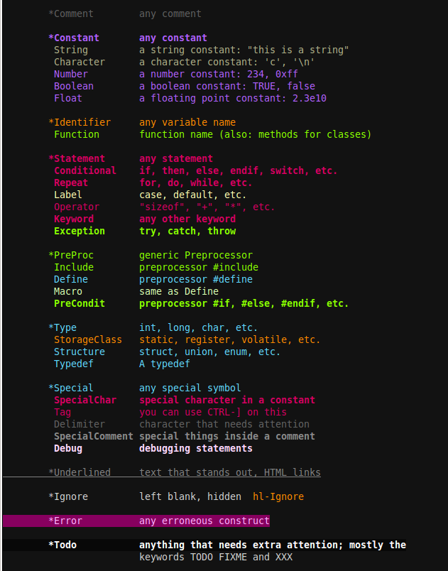

# BigDataScript Vim syntax highlight plugin

## Thus far - plugin:

I thought to give a quick break down of the syntax highlighting

- `break continue wait exit return checkpoint breakpoint` are all Statements
- `print println` are highlighted as functions (just like `print` in python)
- `task sys goal dep par` are also highlighted as functions...

Here is by the way how colors look for me using `molokai` colorsheme 

So if you have any suggestions and/or other comments on the plugin please don't hesitate to raise and issue
or flick me email. 

----------------------------------------------------------------------------------------------------

Okay, It turned out much bigger job to make syntax highlight than I anticipated at the start...

I understand all [pathogen](https://github.com/tpope/vim-pathogen) plugin does is it sets the
right `runtimepath` to look in `bundle` directory for all other relevant directories and I am pretty
sure than my plugin is pathogen compatible and therefore:

## Installation

### Pathogen

`git clone https://github.com/serine/bdsSyntaxHighlight.git ~/.vim/bundle/bdsSyntaxHighlight`

And you should get your bds syntax highlighting

### Old school (Vim) way

You need to place all directories under `~/.vim/`. If you already have some or all of those directories simply
move `bds.vim` file into appropriate directory name.

e.g

- `git clone https://github.com/serine/bdsSyntaxHighlight.git ~/tmp/bdsSyntaxHighlight/`

~~~{.bash}
$ ls -1 ~/tmp/bdsSyntaxHighlight
~~~
~~~{.output}
ftdetect
ftplugin
indent
README.md
supplementary
syntax
~~~

_if none of those directories exist in `~/.vim/`_

~~~{.bash}
$ mv ftdetect ftplugin indent syntax ~/.vim/
~~~

_else_

~~~{.bash}
$ mv ftdetect/bds.vim ~/.vim/ftdetect/
~~~

Repeat for all of bds.vim files.

## Useful links

_this mainly a reminder for myself, but also for other who developing syntax highlight Vim plugins_

[GO-syntax-highlight](https://github.com/fatih/vim-go)
